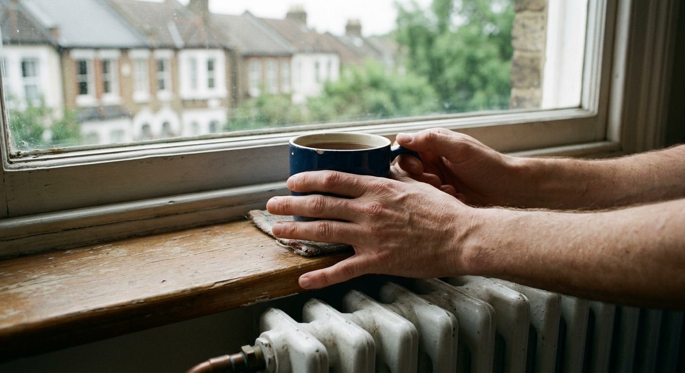
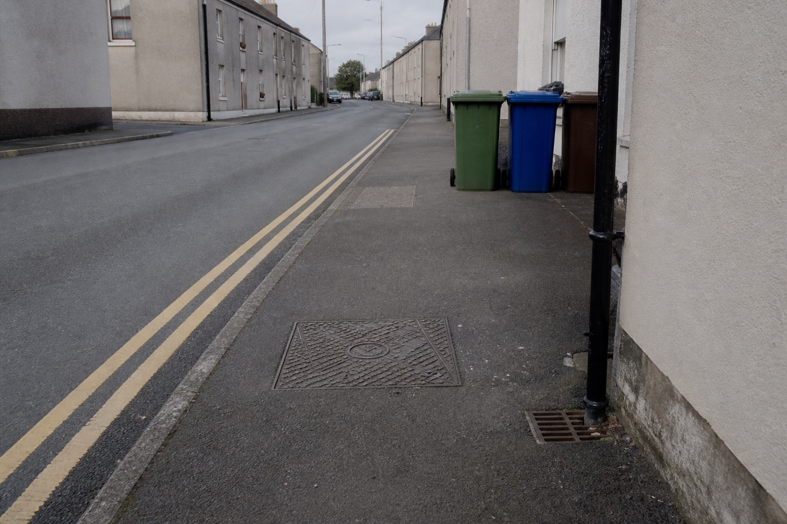

# britcheck 🇬🇧

A Claude Code skill that checks AI-generated images of Britain and catches the ones that secretly look American.

AI image models train mostly on American photos. Ask one for a British street and you often get an American street in a British costume: wrong plug sockets, a mailbox on a post, a fire hydrant on the pavement, California sunshine over a Manchester terrace. Researchers found the same thing when they [asked Stable Diffusion for houses around the world](https://www.washingtonpost.com/technology/interactive/2023/ai-generated-images-bias-racism-sexism-stereotypes/) – whatever country they named, they got an American house back.

britcheck scores each image, explains the flaws, and tells you what to fix.

## Install

Clone into your skills directory:

```bash
git clone https://github.com/Theo7777/britcheck ~/.claude/skills/britcheck
```

Or project-local:

```bash
git clone https://github.com/Theo7777/britcheck .claude/skills/britcheck
```

Then copy the reviewer agent alongside your other agents:

```bash
cp ~/.claude/skills/britcheck/agents/britcheck-reviewer.md ~/.claude/agents/
```

## Use

Paste an image into Claude Code and ask:

> does this look British?

Or point it at a folder:

> britcheck ~/Downloads/uk-street-batch

A single image is reviewed on the spot. A folder gets one reviewer per image, running in parallel, and the verdicts are collected into a dated report.

```
=== BRITCHECK SUMMARY ===
Folder:      ~/Downloads/uk-street-batch
Reviewed:    12
Ship (8+):   7
Weak (6-7):  3
Reject (<6): 2

Most common failure: US plug socket (4 images)
```

## How it works

Every image gets two scores out of 10:

- **UK score** – does the scene look like Britain? Sockets, roofs, road markings, vehicles, light.
- **Artefact score** – is it physically believable? The right number of fingers, no melted objects, no bent walls.

The final score is **the lower of the two**, never the average.

Say an image scores 9 for Britishness, but a hand has six fingers: artefact score 4. The average is 6.5, a pass. But no person would pass that image. One bad flaw ruins a picture, and taking the lower score copies that judgement.

**8 or above ships. Anything lower gets sent back with a fix.**

## What it looks for

The full checklist is in `references/uk-rubric.md` – 11 categories covering everything from plug sockets to road markings. Every check falls into one of four kinds.

**Instant fails** cap the UK score at 3. These things basically do not exist in Britain:

- A US plug socket – two flat pins, no switch. British sockets have three rectangular pins and a switch on the faceplate.
- A fire hydrant on the pavement. Britain's hydrants are underground, marked by a small yellow "H" plate. A red hydrant is the most reliable American giveaway there is, and models draw them constantly.
- A mailbox on a post at the kerb. British post comes through a slot in the front door.
- Insect screens on windows. British houses do not have them.
- Traffic lights hanging from wires over a junction. British lights sit on posts.
- Bumpy "orange-peel" wall texture. British walls are plastered smooth.

**Wrong-looking** details cap the score at 6. Possible in Britain, but off: vinyl siding, an asphalt shingle roof, a giant fridge with an ice dispenser, an open-plan "great room".

**Small deductions** are minor details that cost a point each.

**British details** lift a borderline image. Things that only exist here: wheelie bins in different colours, double yellow lines, a green telecoms cabinet on the pavement, a TV aerial on the chimney, a washing machine under the kitchen counter, a drain grate at the bottom of a downpipe. Three or more can carry an image over the line. An image is never penalised for lacking them – a close-up of a kitchen cannot show a street.

## What it does not check

**Nothing about how people look.** Not their features, not their ethnicity. Britain looks like everyone, and guessing nationality from a face is both wrong and unreliable.

The tool scores only the built environment, objects, clothing, light, and text. People in an image are only checked for AI glitches – finger count, merged hands, warped anatomy – which is a question about physics, not nationality.

This is a deliberate design decision.

## Worked examples

**[See all 13 scored examples →](assets/examples/)** – every image with the prompt that produced it and the verdict it got. Six ship, one weak, six reject.

They were generated with two models on purpose – seven with OpenAI's `gpt-image-2`, six with Google's Nano Banana 2 – so the checks work on anyone's output, not one model's habits.

The failure images were generated by deliberately naming the American element in the prompt. A test has to be reproducible. They show what britcheck catches, not how often models get it wrong.

### One bad flaw ruins the picture



**UK 9 · Artefact 4 → final score 4. Reject.**

Everything here is British: the sash window with peeling paint, the radiator under the sill, the terrace through the glass, the mug of tea, the grey light. 9 out of 10.

But the hand holding the mug has six fingers, and the two hands merge at the wrist. 4 out of 10. The final score is 4, and the image goes back. An average would have passed it.

### Small details can rescue a plain image



**UK 8 · Artefact 9 → final score 8. Ships.**

The buildings here are plain and could be anywhere. On its own the scene sits at 7 – a fail.

But look at the ground: double yellow lines, a cast iron manhole cover, three wheelie bins in different colours, a drain grate under the downpipe. Those details only exist in Britain, and they carry the image over the line.

### The examples improved the checklist

Building the example set corrected the checklist twice – both times because the image was right and the rule was wrong. Bright sunshine stopped being a mark against an image, because Britain has summer. Overhead cables stopped counting for much, because plenty of real northern streets have them.

Checks on **objects** – a socket, a hydrant, a mailbox – are reliable, because they are either there or not. Checks on **atmosphere** – light, cables – are not, because Britain varies.

## It never touches your files

britcheck reads images and writes a report. It does not rename, move, delete, or regenerate anything. If you want files renamed with their scores, it prints the commands and you run them yourself.

## Regional scope

The checklist describes typical England, where most housing and most commissioned images sit. Scotland, Wales, and Northern Ireland build differently, and rural Britain really does have overhead poles and streets with no markings.

The reviewer applies the checks that fit the scene and skips the ones that do not. A Highland farmhouse loses nothing for lacking a telecoms cabinet.

## Why it exists

I run AI content pipelines daily. The thing that separates a working pipeline from a demo is the quality gate at the end. Generating images is easy. Knowing when an image is not good enough, and saying so consistently, is the hard part.

This is that gate, for one specific failure I kept hitting.

## Licence

MIT. Do what you like with it.