# The example set

Thirteen images, each isolating one behaviour of the rubric. **6 ship, 1 weak, 6 reject.**

The failure images were generated by deliberately naming the American element in the prompt. A test has to be reproducible. They show what britcheck catches, not how often models get it wrong.

Generated across two vendors on purpose: **7 with OpenAI `gpt-image-2`, 6 with Google `gemini-3.1-flash-image-preview` (Nano Banana 2)**. A gate tuned to one generator's quirks is not a gate.

Every image below shows the prompt that produced it and the verdict britcheck returned. Machine-readable versions of the verdicts are in [`verdicts.json`](verdicts.json).

## At a glance

| # | Image | Model | UK | Artefact | Overall | |
| --- | --- | --- | --- | --- | --- | --- |
| 01 | [Clean pass, exterior](#01) | `gpt-image-2` | 9 | 9 | **9** | **Ships** |
| 02 | [Clean pass, interior](#02) | `nano-banana-2` | 9 | 9 | **9** | **Ships** |
| 03 | [Hard fail – US plug socket](#03) | `nano-banana-2` | 3 | 8 | **3** | **Reject** |
| 04 | [Hard fail – US pickup on the drive](#04) | `gpt-image-2` | 3 | 9 | **3** | **Reject** |
| 05 | [Hard fail – insect screens and wall texture](#05) | `nano-banana-2` | 3 | 9 | **3** | **Reject** |
| 06 | [Hard fail – kerbside mailbox](#06) | `gpt-image-2` | 3 | 9 | **3** | **Reject** |
| 07 | [Hard fail – fire hydrant and wire-hung signals](#07) | `nano-banana-2` | 3 | 8 | **3** | **Reject** |
| 08 | [Strong tell – American building fabric](#08) | `gpt-image-2` | 6 | 9 | **6** | **Weak** |
| 09 | [Soft detractor – cable web over the street](#09) | `gpt-image-2` | 8 | 9 | **8** | **Ships** |
| 10 | [Soft detractor – bright summer light](#10) | `nano-banana-2` | 8 | 9 | **8** | **Ships** |
| 11 | [The minimum rule](#11) | `nano-banana-2` | 9 | 4 | **4** | **Reject** |
| 12 | [Confirmers lifting a borderline](#12) | `gpt-image-2` | 8 | 9 | **8** | **Ships** |
| 13 | [Regional edge case – Kent weatherboard](#13) | `gpt-image-2` | 9 | 9 | **9** | **Ships** |

Two independent scores out of ten, then **the lower of the two**, never the average. Ship bar is 8.

---

<a id="01"></a>

## 01 – Clean pass, exterior

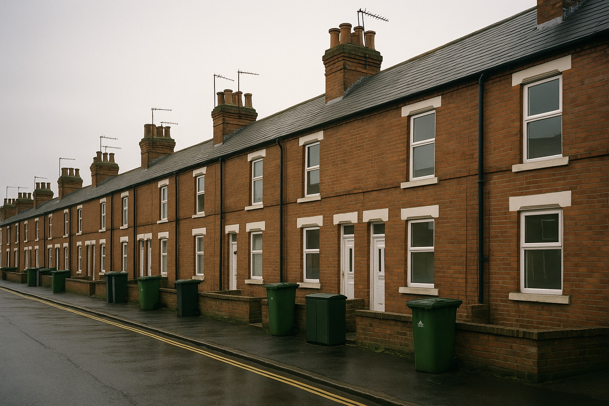

**UK 9 · Artefact 9 → 9** · **Ships** · `gpt-image-2`

> Regenerated on gpt-image-2, which produced the green telecoms cabinet that gpt-image-1 omitted.

<details><summary>Prompt</summary>

```text
A row of Victorian red brick terraced houses on a British street, overcast grey sky,
flat diffuse light, wet tarmac. Slate pitched roofs with brick chimney stacks and clay
pots. H-shaped TV aerials on the chimneys. Black uPVC downpipes ending in square metal
drain gullies. Double yellow lines along the kerb. Green and black wheelie bins on the
pavement. A green telecoms cabinet. Low brick garden walls. White uPVC windows.
Documentary photograph, 35mm, natural light, realistic, not stylised.
```

<b>Confirmers found (11):</b> terraced form with bay windows, slate pitched roofs, brick chimney stacks with clay pots, H-shaped TV aerials along the roofline, green telecoms cabinet on the pavement, black downpipes, double yellow lines, green and black wheelie bins, low brick garden walls, yellow rear number plate, wet tarmac under flat overcast.

</details>

---

<a id="02"></a>

## 02 – Clean pass, interior

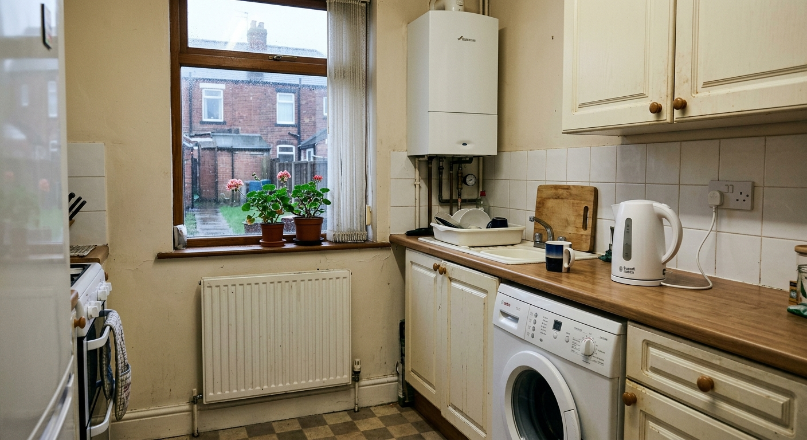

**UK 9 · Artefact 9 → 9** · **Ships** · `nano-banana-2`

<details><summary>Prompt</summary>

```text
A small British kitchen in a terraced house. A washing machine built in under the
worktop. A white kettle on the counter. A white three-pin switched electrical socket
on the wall above the worktop. A white panel radiator under the window. A combi boiler
on the wall. Grey overcast daylight through the window. Slightly worn and lived in.
Documentary photograph, 35mm, natural light, realistic, not stylised.
```

<b>Confirmers found (8):</b> combi boiler on the wall, panel radiator under the window with TRV, washing machine under the worktop, kettle on the counter, switched three-pin double socket, terraced houses through the window, fence panels, compartmentalised small room.

</details>

---

<a id="03"></a>

## 03 – Hard fail – US plug socket

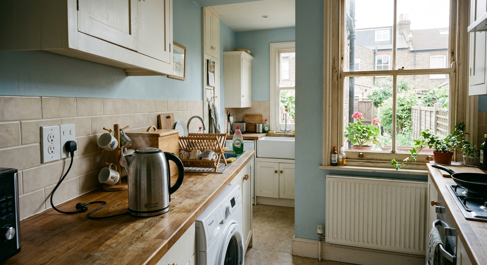

**UK 3 · Artefact 8 → 3** · **Reject** · `nano-banana-2`

- `plug_socket` (critical) – American two-gang duplex outlet above the worktop, with a UK three-pin plug pushed into it. Physically impossible as well as wrong.
- `cable_routing` (minor) – A second flex leaves the lower socket and terminates in mid-air on the worktop.

**Fix:** Regenerate with a white UK three-pin switched double socket above the worktop, one appliance flex plugged in and traced to the kettle.

<details><summary>Prompt</summary>

```text
A small British kitchen in a terraced house, kettle on the counter, white panel
radiator under the window. On the wall above the worktop, an American two-pin
unswitched electrical outlet, clearly visible in the foreground. Documentary
photograph, 35mm, natural light, realistic, not stylised.
```

<b>Confirmers found (6):</b> kettle on the counter, washing machine under the worktop, panel radiator with TRV, butler sink, terraced houses through the window, fence panels.

</details>

---

<a id="04"></a>

## 04 – Hard fail – US pickup on the drive

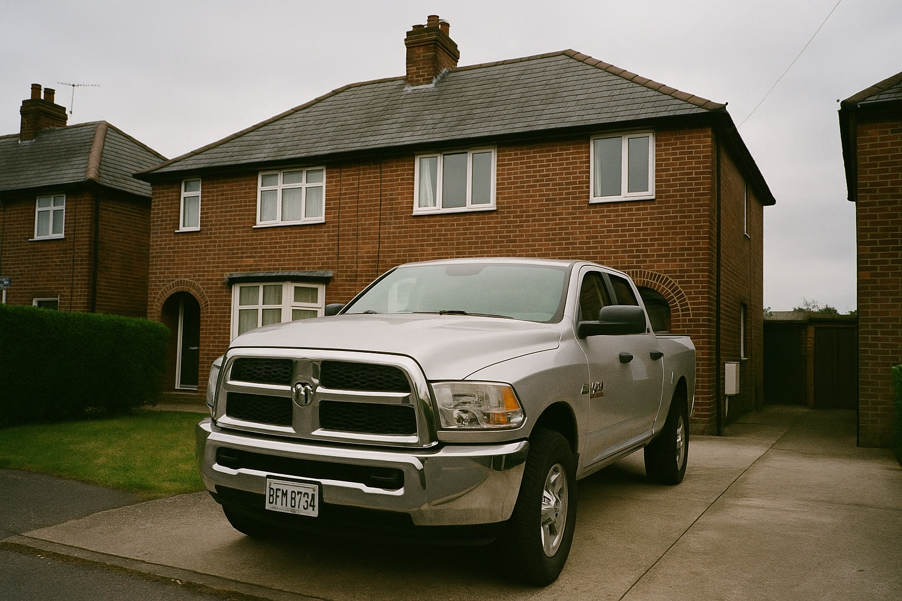

**UK 3 · Artefact 9 → 3** · **Reject** · `gpt-image-2`

- `work_vehicle` (critical) – Full-size American crew-cab pickup filling the driveway of a British semi.
- `number_plate` (minor) – Washington State plate front and rear rather than white front, yellow rear.

**Fix:** Regenerate with a white Ford Transit panel van, right-hand drive, yellow rear number plate.

<details><summary>Prompt</summary>

```text
A British semi-detached red brick house with a slate roof, overcast grey sky. A large
American pickup truck parked on the driveway in the foreground, left-hand drive, US
licence plate. Documentary photograph, 35mm, natural light, realistic, not stylised.
```

<b>Confirmers found (8):</b> 1930s brick semi with tile-hung bay, concrete tile roof, brick chimney, TV aerial, alarm box on the front elevation, gravel drive, low brick wall, flat overcast light.

</details>

---

<a id="05"></a>

## 05 – Hard fail – insect screens and wall texture

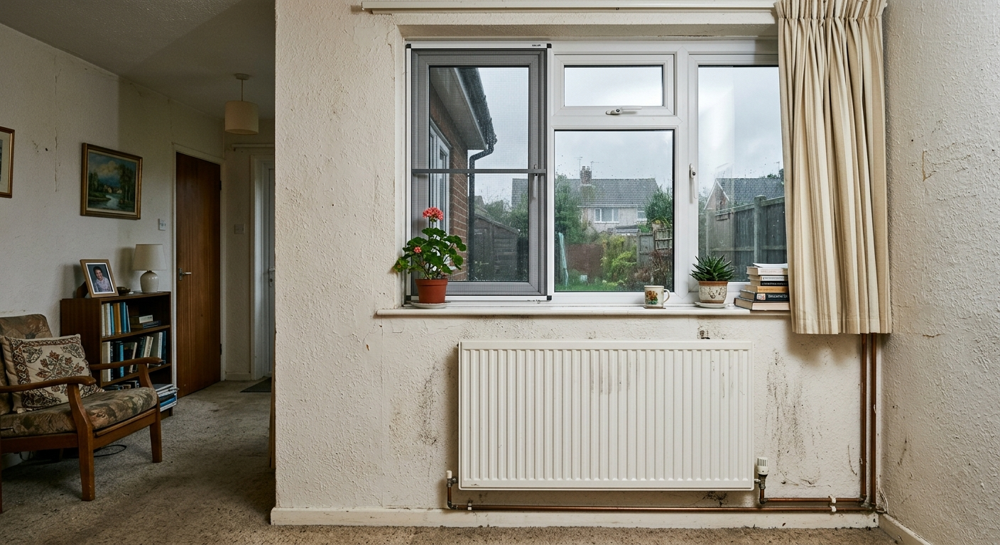

**UK 3 · Artefact 9 → 3** · **Reject** · `nano-banana-2`

- `insect_screens` (critical) – Mesh insect screen fitted to the left casement. British houses do not have them.
- `wall_texture` (critical) – Heavy stipple and orange-peel texture across every wall. British walls are wet-plaster skimmed flat.

**Fix:** Regenerate with smooth skimmed plaster walls and no screens on the windows.

<details><summary>Prompt</summary>

```text
An interior room with insect screens fitted to the windows and heavily textured
orange-peel plaster walls. A panel radiator under the window. Overcast daylight.
Documentary photograph, 35mm, natural light, realistic, not stylised.
```

<b>Confirmers found (5):</b> panel radiator with TRV and copper pipework, uPVC casement with a top-opening light, semis and fence panels through the window, fitted carpet, pendant light with a shade.

</details>

---

<a id="06"></a>

## 06 – Hard fail – kerbside mailbox

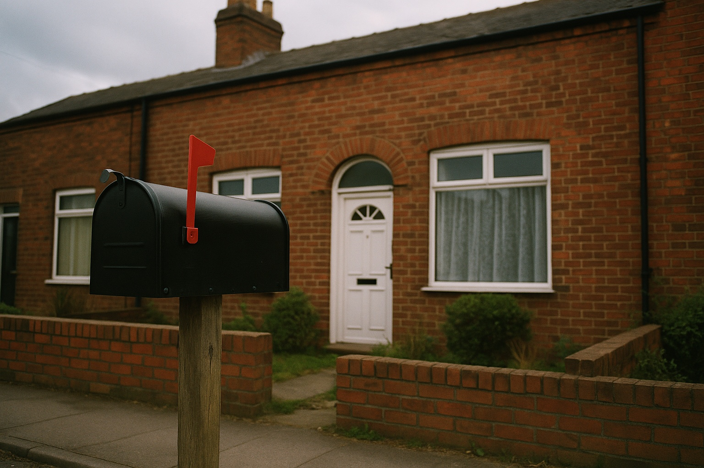

**UK 3 · Artefact 9 → 3** · **Reject** · `gpt-image-2`

- `kerbside_mailbox` (critical) – American post-mounted mailbox with the flag raised, standing at the kerb of a house that already has a letterbox in its front door.

**Fix:** Remove the kerbside mailbox entirely. Post is delivered through the slot in the door.

<details><summary>Prompt</summary>

```text
The front of a British red brick terraced house with a low garden wall, overcast grey
sky. An American mailbox on a wooden post at the kerb in the foreground, with the red
flag raised. Documentary photograph, 35mm, natural light, realistic, not stylised.
```

<b>Confirmers found (8):</b> red brick terrace with bay windows, slate roof and brick chimneys, arched brick door heads, letterbox slots in both front doors, low brick garden walls, clipped hedges, black downpipe, flat overcast light.

</details>

---

<a id="07"></a>

## 07 – Hard fail – fire hydrant and wire-hung signals

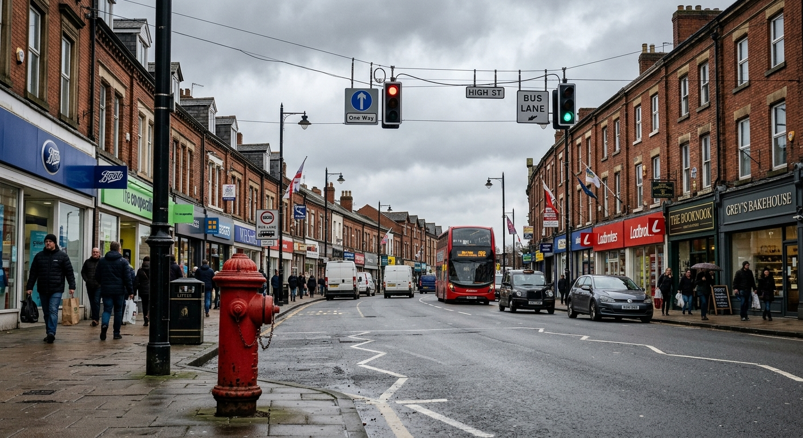

**UK 3 · Artefact 8 → 3** · **Reject** · `nano-banana-2`

- `fire_hydrant` (critical) – Red above-ground American fire hydrant on the pavement in the foreground. UK hydrants are underground behind a small yellow H plate.
- `traffic_lights_on_wires` (critical) – Signals and signs suspended on catenary wires across the junction. UK signals are post-mounted at the stop line.

**Fix:** Remove the hydrant. Move the signals onto black posts at the stop line with white backing boards.

> Two hard fails in two different categories. Per the rubric this means the model produced an American street wearing British signage, not a British street with one error.

<details><summary>Prompt</summary>

```text
A British high street with terraced shopfronts under a grey overcast sky. A red
American fire hydrant on the pavement in the foreground. Traffic lights suspended on
wires stretched across the junction overhead. Documentary photograph, 35mm, natural
light, realistic, not stylised.
```

<b>Confirmers found (9):</b> red double-decker bus, black cab, terraced brick shopfronts, HIGH ST nameplate, bus lane sign, one-way sign, zig-zag road markings, yellow rear number plates, wet road under flat overcast light.

</details>

---

<a id="08"></a>

## 08 – Strong tell – American building fabric

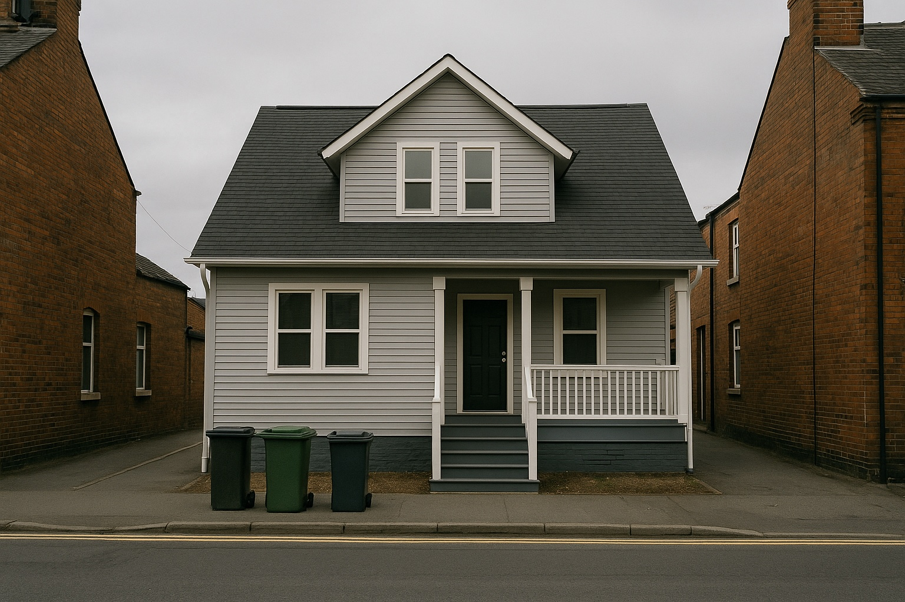

**UK 6 · Artefact 9 → 6** · **Weak** · `gpt-image-2`

- `exterior_walls` (minor) – Pale grey vinyl siding on every elevation.
- `roof` (minor) – Dark asphalt shingle with a dormer, against slate on the neighbours.
- `front_door` (minor) – Covered porch with steps and railings rather than a door onto the pavement.

**Fix:** Regenerate the house in red brick with a slate pitched roof and a front door opening directly onto the forecourt.

> gpt-image-2 set the American house directly into a terrace row, sharing party walls with brick neighbours. Sharper contrast than the gpt-image-1 version.

<details><summary>Prompt</summary>

```text
An American suburban house clad in pale grey vinyl siding with a dark grey asphalt
shingle roof and a covered front porch with steps and railings, standing on a British
street under a grey overcast sky. Wheelie bins on the pavement, double yellow lines
along the kerb, red brick terraced houses visible either side. Documentary photograph,
35mm, natural light, realistic, not stylised.
```

<b>Confirmers found (5):</b> double yellow lines, wheelie bins, red brick terraces on both sides, street lamp column, flat overcast light.

</details>

---

<a id="09"></a>

## 09 – Soft detractor – cable web over the street

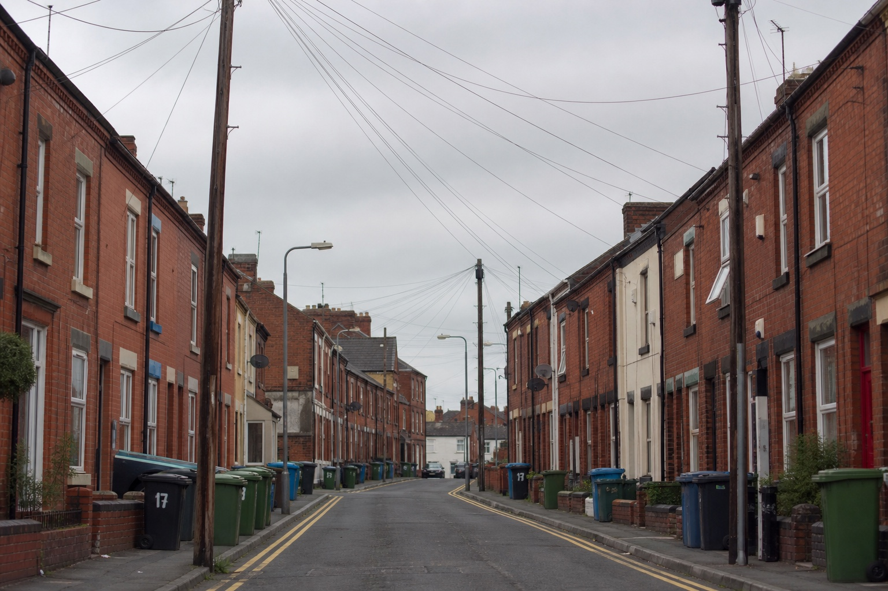

**UK 8 · Artefact 9 → 8** · **Ships** · `gpt-image-2`

- `dense_cable_web` (minor) – Poles both sides with several spans crossing the carriageway. Denser than typical, but this is genuinely what northern terraced streets look like.

> This fixture weakened its own check twice. Base 7 for the cable density, lifted back to 8 by seven confirmers. Overhead cables turned out to be poor evidence of Americanness on their own, so the rubric now treats them as a soft detractor that only counts alongside American housing and absent road markings.

<details><summary>Prompt</summary>

```text
A British red brick terraced street under a grey overcast sky, wheelie bins and double
yellow lines along the kerb. Timber utility poles down both sides of the road with
heavy overhead cables crossing above the street. Documentary photograph, 35mm, natural
light, realistic, not stylised.
```

<b>Confirmers found (7):</b> red brick terraces, double yellow lines both sides, numbered wheelie bins, satellite dishes, chimney stacks, street lamp columns, flat overcast light.

</details>

---

<a id="10"></a>

## 10 – Soft detractor – bright summer light

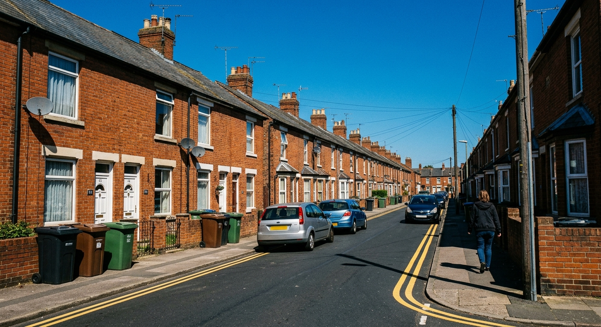

**UK 8 · Artefact 9 → 8** · **Ships** · `nano-banana-2`

- `light_quality` (minor) – Bright direct sun with hard shadows. Legitimate for a British summer day, so a soft detractor only. The ground is not bleached and the planting is green.

> This fixture changed the rubric. An earlier version treated any hard blue-sky sun as a strong tell capping uk_score at 6, which would have rejected a real British summer street. The single pole on the right is also correctly ignored now.

<details><summary>Prompt</summary>

```text
A British red brick terraced street with slate roofs, chimney pots, wheelie bins and
double yellow lines, under a cloudless deep blue sky with harsh direct overhead
sunlight casting hard black shadows. Documentary photograph, 35mm, natural light,
realistic, not stylised.
```

<b>Confirmers found (7):</b> red brick terraces, slate roofs and chimney pots, TV aerials and satellite dishes, double yellow lines, three-colour wheelie bins, yellow rear number plates, front doors onto small forecourts.

</details>

---

<a id="11"></a>

## 11 – The minimum rule


**UK 9 · Artefact 4 → 4** · **Reject** · `nano-banana-2`

- `hand_anatomy` (critical) – Six digits on the hand holding the mug, and the two hands merge into one another at the wrist.

**Fix:** Regenerate with a single hand on the mug, fingers clearly separated, or crop to the mug and sill only.

> The demonstration of the minimum rule. uk_score 9, artefact_score 4. An average would have shipped this at 6.

<details><summary>Prompt</summary>

```text
Close up of a person's hands holding a mug of tea on a windowsill in a British
terraced house, a white panel radiator below the sill, overcast grey light through the
window. The left hand has six fingers, clearly visible, and the grip does not close
properly around the mug. Documentary photograph, 35mm, natural light, realistic, not
stylised.
```

<b>Confirmers found (5):</b> timber sash window with peeling paint, column radiator below the sill, terraced houses through the glass, mug of tea, damp flat overcast light.

</details>

---

<a id="12"></a>

## 12 – Confirmers lifting a borderline


**UK 8 · Artefact 9 → 8** · **Ships** · `gpt-image-2`

> Base score 7: rendered terraces, no distinctive architecture, nothing identifying in the built form. Eight confirmers lift it to 8, and gpt-image-2 put the manhole cover and gully grate in the foreground where they read clearly.

<details><summary>Prompt</summary>

```text
A plain featureless residential street under flat grey overcast light, with no
distinctive architecture. Double yellow lines along the kerb, a square cast iron
manhole cover set into the pavement, three coloured wheelie bins out for collection,
and a square metal drain gully at the base of a black downpipe. Documentary
photograph, 35mm, natural light, realistic, not stylised.
```

<b>Confirmers found (8):</b> double yellow lines, square cast iron manhole cover in the pavement, second cover further up, three wheelie bins in separate colours, gully grate at the base of the downpipe, black cast iron downpipe, rendered terraces, flat grey overcast.

</details>

---

<a id="13"></a>

## 13 – Regional edge case – Kent weatherboard

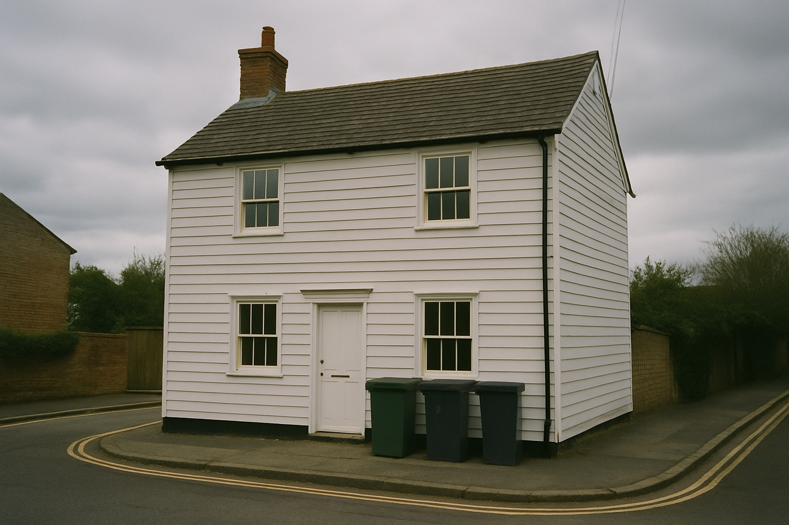

**UK 9 · Artefact 9 → 9** · **Ships** · `gpt-image-2`

> A regional edge case, kept deliberately. White painted weatherboard is genuine Kent, Essex, and Sussex vernacular. A rubric reading timber cladding as automatically American would cap this at 6 and reject a real British house. Compare with 08, which is the actual American form.

<details><summary>Prompt</summary>

```text
A white painted timber weatherboarded cottage in Kent, England, with a plain clay tile
pitched roof and a red brick chimney stack, timber sash windows, under a grey overcast
sky. Double yellow lines along the kerb, three wheelie bins, brick boundary walls
either side. Documentary photograph, 35mm, natural light, realistic, not stylised.
```

<b>Confirmers found (9):</b> plain clay tile roof, weathered and mossy, red brick chimney stack with two pots, timber sash windows with glazing bars, letterbox slot in the painted front door, black cast iron downpipe, brick boundary walls, three wheelie bins, double yellow lines, flat overcast light.

</details>

---

## What the fixtures changed

Building this set corrected the rubric twice, both times because an image was right and the rubric was wrong.

1. **Blue sky stopped being a strong tell.** Image 10 is a real-looking British summer street. Capping it at 6 for having hard shadows would reject legitimate work. What reads as American is high sun *with bleached, arid ground*, so that is the check now, and plain bright light is a soft detractor.

2. **Overhead cables were downgraded twice and now barely count.** They started as a strong tell, on the strength of UK stock contributors naming them as their top complaint. Image 10 has a pole and is plainly a real British street. Image 09 has poles on both sides and a dozen spans, and is *still* plainly a real British street, because that is what northern terraced streets look like.

   The honest result underneath: the rubric's **object** checks (sockets, hydrants, mailboxes) are strong, and its **ambient** checks (light, cables) are weak. Better to know that than to keep a tidy-looking check that rejects real work.

## Regenerating

Prompts are reproduced above and collected in [`PROMPTS.md`](PROMPTS.md). Where britcheck disagrees with the expectation, check the image before the rubric – usually the prompt did not produce what was asked for. Both corrections above came from doing that and finding the rubric at fault instead, which is the less common outcome and worth pausing on when it happens.
